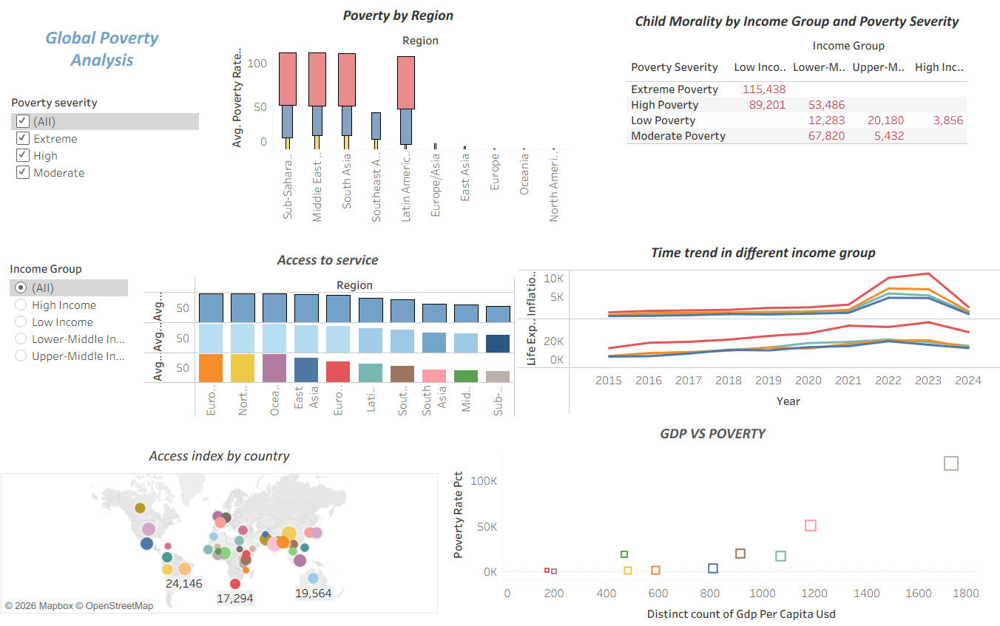

# CodeAlpha_Data_Analytics_Task3_Data_Visulization
This portfolio analysis identifies high-impact investment opportunities in underserved markets by examining global poverty dynamics, service access gaps, and GDP-poverty disconnects across regions and income groups.
readme_content = """# Global Poverty Analysis

> A Tableau-native dashboard analyzing global poverty, child mortality, service access, and GDP correlations across regions and income groups.



---

## About This Project

This dashboard was built entirely in **Tableau Desktop** (2024.x+) and explores multidimensional poverty data through six coordinated views. It demonstrates advanced Tableau techniques including LOD expressions, dual-axis combinations, Mapbox integration, and cross-dashboard filtering.

---

## Dashboard Architecture

### Data Model
- **Primary Data Source:** Single blended source with country-level granularity
- **Granularity:** Country × Year × Poverty Severity × Income Group
- **Extract:** Optimized .hyper extract for performance

### Worksheets

| Worksheet | Viz Type | Key Technique |
|-----------|----------|---------------|
| Poverty by Region | Diverging Bar | Fixed LOD + Color by Severity |
| Child Mortality Matrix | Highlight Table | Calculated Field for Severity × Income |
| Access to Service | Stacked Bar | Measure Names + Custom Sort |
| Time Trend | Dual-Axis Line | Synchronized Axes + Reference Band |
| Access Index Map | Symbol Map | Mapbox WMS + Sized Circles |
| GDP vs Poverty | Scatter Plot | Log Axis + Trend Line + Outlier Highlight |

### Dashboard Layout
- **Container:** Tiled layout, 1200×1600px
- **Filters:** Global Poverty Severity (multi-select), Income Group (single-select radio)
- **Interactivity:** Cross-filtering enabled across all worksheets via Dashboard > Actions

---

## Tableau Techniques Used

### Calculated Fields
```
// Poverty Severity Rank
RANK_DENSE(AVG([Poverty Rate]), 'desc')

// Access Index Normalized
(AVG([Access Water]) + AVG([Access Health]) + AVG([Access Edu])) / 3

// GDP Per Capita Bin
IF [GDP Per Capita] < 500 THEN "Low"
ELSEIF [GDP Per Capita] < 1000 THEN "Lower-Mid"
ELSEIF [GDP Per Capita] < 1500 THEN "Upper-Mid"
ELSE "High" END
```

### LOD Expressions
```
// Fixed Regional Average
{FIXED [Region] : AVG([Poverty Rate])}

// Exclude Severity for Total
{EXCLUDE [Poverty Severity] : SUM([Child Mortality])}
```

### Parameters
- `pSeverityParam` — String list: (All), Extreme, High, Moderate
- `pIncomeParam` — String list: (All), High Income, Low Income, Lower-Middle, Upper-Middle

### Map Configuration
- **Map Service:** Mapbox Streets v11 (custom style)
- **WMS URL:** `https://api.mapbox.com/styles/v1/mapbox/light-v11/tiles/{z}/{x}/{y}`
- **Circle Size:** `SUM([Access Index])` — Square root scaling
- **Circle Color:** Region dimension

---
## Contact

- **Tableau Public:** [Shreya Tarafdar](https://public.tableau.com/app/profile/shreya.tarafdar)
- **LinkedIn:** [Shreya Tarafdar](https://https://www.linkedin.com/in/shreya-tarafdar-726b7430a/)
